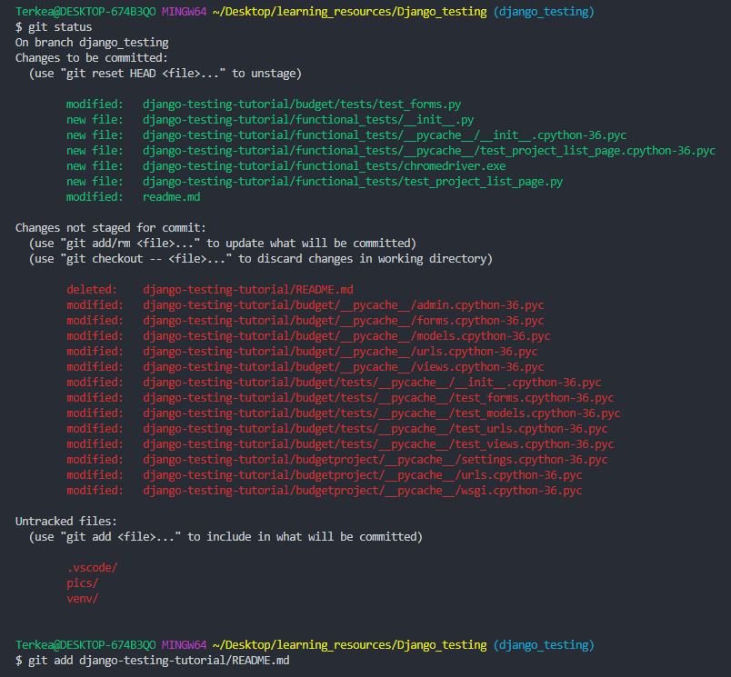
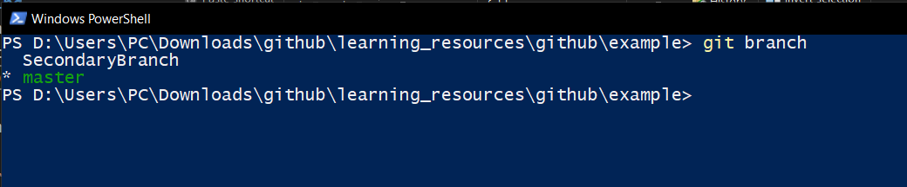
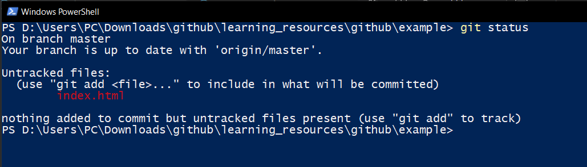

> - Download [Git](https://git-scm.com/downloads)
# An Approachable Guide to GitHub
<p align="center">
  
</p>


## Creating a GitHub Repository and Clonning
You can create a new Repository on GitHub through their [website](https://github.com/).
1. When creating a new Repository, remember to tick the box to add an initial README file, this makes things easier to setup.
2. On a terminal of your choice, choose a folder, then: 
    ```bash
    git clone RepositoryName
    ```

## Checking Status

The `git status` command displays the state of the working directory and the staging area. It lets you see which changes have been staged, which haven't, and which files aren't being tracked by **Git**.

1. Go inside the folder of your Repository. (Windows: `Shift Right-Click` within a folder and choose open terminal or PowerShell)

2. Check the Status to see information such as what **branch** you're currently on: `git status`

    > 

## Commiting
1. Make sure you are on the right **branch** before anything else, **check the status**.

2. The next step is to choose what files will go in the commit. You can do one of the following:

    - If you want to add a specific file/files, do `git add` **FileName**, i.e.:
      ```bash
      git add index.html
      ```
    
    - To add all of the files of the current directory, do:
        ```bash
        git add -A
        ```
        OR
        ```bash
        git add .
        ```
      - > ##### Note: Either of these will compare all of the files from the current repository against the branch selected and add the files that have been changed.
4. To commit, you must do:
    ```bash
    `git commit -m "Write your commit message here"
    ```
    - > The commit message should be very short and is generally a brief message about the changes that you've made.
5. You can commit multiple times but none of the changes will update the online repository until you have pushed them, to do that do:
    ```bash
    git push
    ```
# Working in Teams
When working in teams multiple people will want to make changes to multiple different files and as long as these changes don't change the same file you should just be able to do `git pull` to update your local repository with all of the changes that your peers have commited to the branch that you are on.

However, in a project, it is generally not a good idea for everyone to keep pulling and pushing changes onto the same branch (usually **master** by default), this is why branches exist in the first place.


Branches are essentially copies of a given version (branch) of the repository, but once they are created they obviously do not stay up-to-date with any of the other branches but they can be **merged** back, at which point you can deal with all of the **merge conflicts**, all in one go.

The following diagram illustrates how branches may be used in a project. 

 
> [Image Source](https://gist.github.com/digitaljhelms/4287848)
## Creating Branches
To create a branch, do:
1. Make sure you got the latest version of the **branch** that you want to branch, either by clonning or by pulling the newest changes (`git pull`).
2. Do `git branch` to view existing branches and to verify what **branch** you're currently on as this will be the branch that will be branched.
3. Do `git branch NameOfTheBranch` to create a branch.
## Switching to a different branch

You can switch to a different branch at any point in time, just **be aware** that when you do this your local repository will also change according to the branch that you have switched to.

If you have modified your local repository without commiting the changes and you try to switch to a different branch, a number of things can happen, including:
  - If you have modified any file/files that exist but are different on the other branch, it will not work until you have commited or stashed the changes.
  
  - If the file/files that you modified were originally the same in both branches, it will switch to the other branch and keep your file/files with the modifications.
  - If you just added files that were not previously present in either branch it will also keep them.

To switch branches, do:
```bash
git checkout NameOfTheBranchYouWantToSwitchTo
```
## Working on a Branch - Workflow
Just to recap, we will be creating and commiting changes to a branch.
- Check what branch you are on: 
  ```bash
  git branch
  ```
  > 
    - It is currently on the master.
- Create a branch:
  ```bash
  git branch SecondaryBranch
  ```

- Switch to `SecondaryBranch`
  ```bash
  git checkout SecondaryBranch
  ```


- Make your changes to the **Repository**.
- Check the `status`:
  > 

- Add your files:
  ```bash
  git add .
  ```

- Commit them:
  ```bash
  git commit -m "Added index.html"
  ```
- Push them:
  ```bash
  git push
  ```

If you are working in a project with more people there may be one person that manages all of the mergings, and what that means is that you can keep **pushing** your changes to your branch and just worry about **pulling** the changes whenever that person notifies you that they have merged your branch with some other branch.
  - This would mean that your branch has been outdated, so you must do:
    ```bash
    git pull
    ```
    
    - Ideally, you should arrange an effective way of communication such that you can commit your latest work and know when they are merging your work so that you do not do any further changes while the branch is being merged.

    - > *If you had already done more work after the commit that was merged you should first backup your current local repository and then try to `git pull`. If this doesn't work you could just get the latest version of the branch and try to implement those changes manually.*


## Merging - Workflow
This will show how to merge a branch `master` with a branch `SecondaryBranch`.

In this example, the `SecondaryBranch` is ahead of `master` by 1 commit, in which it was added a file.
- We are currenty on the `SecondaryBranch`.

- Switch to `master` and pull:
  ```bash
  git checkout master
  git pull
  ```
- Switch back to the `SecondaryBranch`
  ```bash
  git checkout SecondaryBranch
  ```
- Merge the `SecondaryBranch` with the `master`
  ```bash
  git merge master
  ```
  > *Possible merge conflicts may be generated here, read about how to solve them [here](https://help.github.com/en/github/collaborating-with-issues-and-pull-requests/addressing-merge-conflicts).*

- Now you just need to push
  ```bash
  git push
  ```
  
 > *Note: Any given branch can be obtained by cloning the whole repository, if you want to switch to a specific branch you need to use `git checkout` name_of_branch, even if it doesn't appear in the `git branch` list.*

#### Useful Resources:
> - GitHub [Cheet Sheet](https://github.github.com/training-kit/downloads/github-git-cheat-sheet.pdf)
> - [How to Write a Git Commit Message](https://chris.beams.io/posts/git-commit/)
> - [A successful Git branching model](https://nvie.com/posts/a-successful-git-branching-model/)
